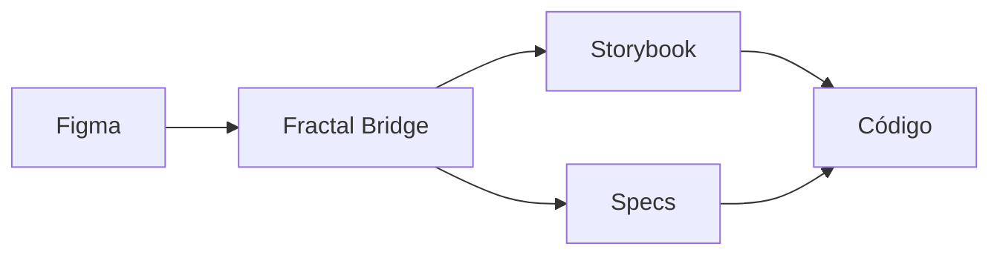

# Getting Started — Fractal Bridge

Primera guía para entender el Design System Fractal y cómo trabajar con él.

## Stack Overview

**Fractal** es el Design System de Telecom Personal Pay, implementado como:

- **UI Library:** `@ppay-mobile/fractal-ui` (React Native + Web)
- **Tokens:** `@ppay-mobile/fractal-tokens` (incluidos automáticamente)  
- **Framework:** Tamagui para sistema de variantes
- **Plataformas:** React Native + Web (react-native-web)

## Herramientas del ecosistema



1. **Figma** — diseños y prototipos
2. **Fractal Bridge** (este repo) — reglas y documentación
3. **Storybook** — componentes vivos y API
4. **Código** — implementación final

## Tu primer componente: Button

Vamos a mapear un Button desde Figma hasta implementación:

### 1. En Figma
Tenés un botón con estas variantes:
- **Size:** sm, md, lg
- **Style:** solid, outline, ghost  
- **State:** default, hover, pressed, disabled

### 2. En Storybook
[Abrir Button en Storybook](LINK_STORYBOOK_BUTTON)

Vas a ver la misma API:
```tsx
<Button 
  size="md"           // sm | md | lg  
  variant="solid"     // solid | outline | ghost
  disabled={false}    // boolean
  loading={false}     // boolean
/>
```

### 3. En código
```tsx
import { Button } from '@ppay-mobile/fractal-ui';

// Botón primario de acción
<Button 
  label="Confirmar pago" 
  variant="solid" 
  size="md"
  onPress={handlePayment}
/>

// Botón secundario  
<Button 
  label="Cancelar" 
  variant="outline" 
  size="md"
  onPress={handleCancel}
/>
```

## Setup básico

### Instalación
```bash
npm install @ppay-mobile/fractal-ui react-native-reanimated react-native-svg react-native-safe-area-context
```

### Registry privado (.npmrc)
```
@ppay-mobile:registry=https://gitlab.com/api/v4/projects/70809357/packages/npm/
//gitlab.com/api/v4/projects/70809357/packages/npm/:_authToken=${GITLAB_PERSONAL_TOKEN}
```

### Provider setup
```tsx
import { FractalUIProvider } from '@ppay-mobile/fractal-ui';

export default function App() {
  return (
    <FractalUIProvider>
      {/* Tu app aquí */}
    </FractalUIProvider>
  );
}
```

## Tu primera pantalla

Vamos a crear una pantalla simple de perfil:

```tsx
import { View, ScrollView, Text, Card, Button, Avatar } from '@ppay-mobile/fractal-ui';

export function ProfileScreen() {
  return (
    <ScrollView style={{ padding: '$spacing-lg' }}>
      <View style={{ gap: '$gap-lg' }}>
        
        {/* Header con avatar */}
        <View style={{ alignItems: 'center', gap: '$gap-md' }}>
          <Avatar size="lg" />
          <Text variant="heading-lg">Juan Pérez</Text>
          <Text variant="body-md" color="$color-neutral-medium">
            juan.perez@personal.com.ar
          </Text>
        </View>

        {/* Card con información */}
        <Card>
          <View style={{ gap: '$gap-sm' }}>
            <Text variant="body-md-semibold">Saldo disponible</Text>
            <Text variant="heading-xl" color="$color-success">
              $12.450,00
            </Text>
          </View>
        </Card>

        {/* Acciones */}
        <View style={{ gap: '$gap-md' }}>
          <Button variant="solid" label="Transferir dinero" />
          <Button variant="outline" label="Recargar saldo" />
          <Button variant="ghost" label="Ver historial" />
        </View>

      </View>
    </ScrollView>
  );
}
```

## Conceptos clave

### Tokens del sistema
Los tokens están disponibles como `$token-name`:
```tsx
// Spacing
padding: '$spacing-sm'    // 8px
padding: '$spacing-md'    // 16px  
padding: '$spacing-lg'    // 24px

// Gaps
gap: '$gap-xs'           // 4px
gap: '$gap-sm'           // 8px
gap: '$gap-md'           // 16px

// Colors  
color: '$color-primary'
color: '$color-success'  
color: '$color-neutral-medium'
```

### Variantes de componentes
Cada componente tiene variantes predefinidas:
```tsx
// Button
<Button variant="solid | outline | ghost" size="sm | md | lg" />

// Text
<Text variant="heading-lg | heading-md | body-md | body-sm" />

// Card  
<Card variant="default | elevated" />
```

## A dónde ir según tu tarea

### 💡 Quiero diseñar una pantalla nueva
1. Lee [Composition Patterns](composition-patterns.md) — layouts típicos
2. Consulta [Business Context](business-context.md) — cuándo usar cada componente  
3. Usa [Component API Mapping](../mappings/component-api-mapping.json) — props exactas

### 🔍 Quiero entender un componente específico  
1. Busca en `docs/components/[nombre].md` — documentación detallada
2. Ve el [Storybook](LINK_STORYBOOK) — ejemplos interactivos
3. Revisa [Token Usage](../mappings/token-usage-examples.md) — tokens en contexto

### 📋 Quiero entregar specs para desarrollo
1. Usa [Design Handoff](../workflows/design-handoff.md) — qué documentar
2. Sigue [Validation Checklist](../workflows/validation-checklist.md) — cómo verificar

### 🤖 Soy un agente IA
1. Lee [Agent Guidelines](agent-guidelines.md) — reglas específicas para agentes
2. Consulta `/AGENTS.md` — implementación técnica
3. Usa `mappings/` — referencias rápidas

## Next Steps

Una vez que hayas probado tu primer componente:
1. Explora más componentes en el [Storybook](LINK_STORYBOOK)
2. Lee sobre [Composition Patterns](composition-patterns.md) para pantallas completas  
3. Entiende el [Business Context](business-context.md) específico de Personal Pay

## ¿Necesitás ayuda?

- **Dudas sobre componentes:** consultar `docs/components/*.md`
- **Problemas de implementación:** revisar `/AGENTS.md`  
- **Tokens y sistema:** ver `docs/tokens/*.md`
- **Workflows y procesos:** explorar `workflows/`