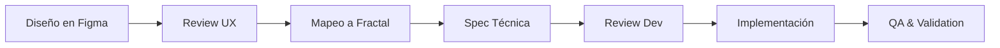

# Design Handoff Workflow

Proceso estándar para entregar diseños de Figma a desarrollo usando Fractal UI.

## Overview del Proceso



## Phase 1: Design Review (UX Lead)

### Pre-handoff Checklist
- [ ] **Componentes están en el DS:** Todos los elementos usan componentes de Fractal
- [ ] **Tokens aplicados:** Spacing, colores, tipografía siguen el sistema
- [ ] **Estados definidos:** default, hover, focus, error, loading, disabled
- [ ] **Responsive behavior:** Mobile y tablet/desktop especificados
- [ ] **Copy final:** Textos reales, no placeholders
- [ ] **Flujo completo:** Happy path y edge cases documentados

### Design Review Template

**Frame:** [Link a Figma]  
**Feature:** [Nombre de la funcionalidad]  
**User Story:** Como [usuario] quiero [acción] para [beneficio]  

**Componentes principales:**
- [ ] Button (variant: solid/outline/ghost, size: sm/md/lg)
- [ ] TextInput (label, placeholder, validation, supportingText)  
- [ ] Card (variant: default/outlined/elevated)
- [ ] Alert (variant: info/success/warning/error)
- [ ] [Otros componentes específicos]

**Business rules:**
- Validaciones requeridas
- Límites y restricciones  
- Estados de error específicos
- Integraciones con backend

---

## Phase 2: Component Mapping (UX + Dev)

### Mapping Session (30min)
**Participantes:** UX Designer + Frontend Dev + (optional) Design System maintainer

**Agenda:**
1. **Walkthrough del diseño** (5min)
2. **Identificar patrones** (10min) - ¿Es pantalla nueva o reutiliza patterns existentes?
3. **Mapear componentes** (10min) - Cada elemento visual → Componente Fractal
4. **Definir estados** (5min) - Loading, error, empty states

### Component Mapping Output
```tsx
// Resultado del mapping session
export function TransferAmountScreen() {
  return (
    <BaseLayout title="Ingresar monto" hasButtonGroup>
      
      {/* Balance card */}
      <Card style={{ backgroundColor: '$color-background-brand-subtle' }}>
        <Row leadingContent={<PersonalPayIcon />}>
          <Text variant="body-sm">
            Disponible <Text variant="body-sm-semibold">${balance}</Text>
          </Text>
        </Row>
      </Card>
      
      {/* Amount input */}
      <View style={{ flex: 1, justifyContent: 'center' }}>
        <InputAmount 
          value={amount}
          onChangeText={setAmount}
          currency="peso"
          placeholder="$0"
        />
      </View>
      
      {/* Quick amounts */}
      <View style={{ flexDirection: 'row', gap: '$gap-sm' }}>
        <Chip label="$5.000" variant="outline" onPress={() => setAmount('5000')} />
        <Chip label="$10.000" variant="outline" onPress={() => setAmount('10000')} />
      </View>
      
      {/* Primary action */}
      <Button 
        variant="solid" 
        label="Continuar"
        disabled={!amount || parseFloat(amount) < 100}
      />
      
    </BaseLayout>
  );
}
```

---

## Phase 3: Technical Specification

### Spec Document Template

**Feature:** Transfer Amount Input  
**Figma:** [Link directo al frame]  
**Epic/Ticket:** [Jira/Linear link]

#### **Component Breakdown**
| Visual Element | Fractal Component | Props/State |
|---------------|-------------------|-------------|
| Balance display | Card + Row | `backgroundColor: '$color-background-brand-subtle'` |
| Amount field | InputAmount | `currency: 'peso'`, validation for min $100 |
| Quick chips | Chip | `variant: 'outline'`, `onPress: setAmount` |
| Continue button | Button | `variant: 'solid'`, `disabled` based on validation |

#### **State Management**
```tsx
const [amount, setAmount] = useState('');
const [loading, setLoading] = useState(false);
const [error, setError] = useState(null);

// Validation
const isValidAmount = amount && parseFloat(amount) >= 100;
```

#### **Business Logic**
- **Monto mínimo:** $100 (mostrar error si menos)
- **Monto máximo:** Límite diario del usuario (consultar API)
- **Saldo insuficiente:** Bloquear acción, mostrar mensaje
- **Quick amounts:** $5K, $10K, $50K (o montos frecuentes del usuario)

#### **API Integration**
```tsx
// GET /user/balance
// POST /transfer/validate-amount
// Response: { valid: boolean, message?: string }
```

#### **Error Scenarios**
- Sin conectividad → Alert variant="error" + retry
- Saldo insuficiente → Alert variant="warning" + "Ver alternativas"
- Límite diario → Alert variant="info" + "Más info sobre límites"

---

## Phase 4: Development Review

### Pre-implementation Review (15min)
**Participantes:** Frontend Dev + UX Designer

**Checklist:**
- [ ] **Component props clarificados:** Todas las props necesarias están en el mapping
- [ ] **Estados edge definidos:** Loading, error, empty states especificados
- [ ] **Tokens verificados:** Spacing, colores, tipografía mapeados correctamente
- [ ] **Responsive approach:** Mobile-first confirmado
- [ ] **API contracts:** Endpoints y payload structure definidos

### Questions to Resolve
Typical questions that come up:

**UX → Dev:**
- "¿Qué pasa si el usuario tipea letras en el monto?"
- "¿El loading state bloquea toda la pantalla o solo el botón?"
- "¿Hay algún debounce en la validación de monto?"

**Dev → UX:**  
- "¿Este spacing es exacto o puedo usar el token más cercano?"
- "¿Los quick amounts son fijos o vienen del backend?"
- "¿Hay algún analytics event que necesite capturar?"

---

## Phase 5: Implementation & QA

### Implementation Guidelines
```tsx
// ✅ Best practices durante desarrollo

// 1. Importar solo lo necesario
import { Button, Card, InputAmount, Chip } from '@ppay-mobile/fractal-ui';

// 2. Usar TypeScript para props
interface TransferAmountProps {
  balance: number;
  onContinue: (amount: string) => void;
  onBack: () => void;
}

// 3. Manejar loading states explícitamente
const [loading, setLoading] = useState(false);

// 4. Usar tokens, no valores hardcodeados
style={{ padding: '$spacing-lg', gap: '$gap-md' }}
```

### QA Checklist

**Visual QA:**
- [ ] Matches Figma design pixel-perfect en mobile
- [ ] Spacing usa tokens correctos ($gap-sm, $spacing-lg, etc)
- [ ] Typography variants correctas (heading-lg, body-md, etc)
- [ ] Colors usan semantic tokens (success, error, neutral)

**Functional QA:**
- [ ] Validation funciona (monto mínimo $100)
- [ ] Quick amounts setean el input correctamente
- [ ] Button disabled/enabled según validation
- [ ] Loading states son claros
- [ ] Error messages son user-friendly

**Cross-device QA:**
- [ ] Mobile portrait (320px - 480px)
- [ ] Mobile landscape (568px - 812px)
- [ ] Tablet (768px+)
- [ ] Touch targets min 44px

**Edge Cases:**
- [ ] Sin conexión a internet
- [ ] Saldo insuficiente
- [ ] Límite diario excedido
- [ ] API timeout/error
- [ ] Texto muy largo en nombres

---

## Phase 6: Validation & Sign-off

### Final Review Session (15min)
**Participantes:** UX Designer + Frontend Dev + QA

**Demo flow:**
1. **Happy path:** Ingreso de monto válido → success
2. **Validation:** Monto menor a $100 → error claro
3. **Edge case:** Sin conexión → retry flow
4. **Visual polish:** Animations, transitions, micro-interactions

### Sign-off Criteria
- [ ] **Functionality:** Todas las user stories funcionan end-to-end
- [ ] **Visual:** Matches el design dentro del 95% (minor adjustments OK)
- [ ] **Performance:** No lag perceptible, transitions fluidas
- [ ] **Accessibility:** Screen reader friendly, contrast OK
- [ ] **Error handling:** Todos los edge cases manejados gracefully

### Handoff Assets

**Para QA:**
- Figma link con casos de test marcados
- Lista de edge cases a verificar
- Device matrix (qué probar en qué dispositivos)

**Para Product:**
- Screen recording del flow funcionando
- Lista de cualquier deviation del design original (con justificación)

**Para Design System:**
- Nuevos patterns que surgieron (para agregar a composition-patterns.md)
- Tokens que faltaron (para proponer nuevos)

---

## Tools & Templates

### Figma Handoff Plugin
Usar el plugin de Fractal (si existe) para:
- Exportar specs automáticamente
- Verificar que componentes están en el DS
- Generar código inicial

### Slack/Communication Templates

**Handoff ready:**
```
🎨 Handoff ready: Transfer Amount Screen
📋 Figma: [link]
🧩 Components: InputAmount, Button, Card, Chip  
⚡ Priority: High (Sprint 23)
🤝 Sync needed? No - specs are clear
📅 Target: End of week
```

**Implementation complete:**
```
✅ Transfer Amount Screen - Ready for QA
📱 Deployed to: staging
🔍 Test with: user@test.com / password123
📋 QA checklist: [Notion link]
🚨 Known issues: None
📅 Review by: Tomorrow 2pm
```

---

*Este workflow debe seguirse para cada feature/screen nueva que require handoff formal*